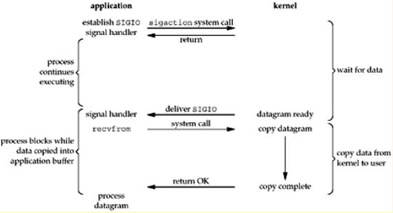

## 浅谈五种IO模型
今天去面试被问到常用的IO模型，虽然了解一点，但不是很清楚，回答的支支吾吾，当时恨不得拿块板砖往自己嘴上拍两下, 回去之后研究了下，本文的主要内容翻译总结自《Unix Network Programming, Volume 1: The Sockets Networking API (3rd Edition)》by W. Richard Stevens  (Author), Bill Fenner (Author), Andrew M. Rudoff (Author)，6.2 I/O Models。

在UNIX网络编程中有五种IO模型：
1. 阻塞型I/O(blocking I/O)
2. 非阻塞型I/O(nonblocking I/O)
3. I/O多路复用(I/O multiplexing)
4. 信号驱动型I/O(signal driven I/O)
5. 异步I/O(asynchronous I/O)

在接下来的例子中，对于输入操作通常有两个不同的阶段：
1. 等待数据准备就绪
2. 将数据从内核拷贝到用户进程中

### 1.阻塞型I/O
阻塞型I/O顾名思义，是进程的执行是阻塞型的，即当一个操作未完成之前，进程中其他的操作被阻塞，直到当前操作完成后才能执行下个操作，如下图所示。

如图所示，进程调用recvfrom时,系统调用直到数据报到达并且被拷贝到程序的缓存中后，或则一个error发生时才会返回。最常见的error是系统调用被一个信号中断。在进程调用recvfrom直到这个函数返回的过程中进程是被阻塞的，当recvfrom成功返回后，我们的程序才处理接收到的数据报。

### 2.非阻塞型I/O
当我们设定一个socket为非阻塞型时，我们是在告诉内核“当我请求的一个I/O操作不能够在进程不进入休眠状态下被完成时，不要让进程进入休眠状态，而是返回一个error.”， 图6.2显示的是一个非阻塞型的事例。

如图所示，前三次我们调用recvfrom，没有数据可以返回，所以内核直接返回一个EWOULDBLOCK error。第四次调用recvfrom时，一个数据报准备就绪，它被拷贝进我们程序的缓存，然后recvfrom成功的返回。我们然后处理这个数据。当一个程序在一个循环中对一个非阻塞型的描述符不停的调用recvfrom时，这被称为轮询。这个程序会一直不停的轮询内核直到某个操作就绪。通常这会造成CPU时间的浪费，但有时候我们会遇到这种模型，通常是在那些只专注于一种操作的系统中。

### 3.I/O多路复用
在I/O多路复用中，我们调用select或则poll，我们会被阻塞在其中的一个调用中，而不是被阻塞在真正的I/O系统调用中。图6.3是一个I/O多路复用模型的总结。

如图，我们阻塞在调用select中，等待有可读的数据报socket。当select返回socket可读时，我们然后调用recvfrom去拷贝数据报到我们的程序的缓存中。

### 4.信号驱动型I/O
我们也可以使用信号，当描述符就绪时，让kernel用SIGIO信号通知我们。我们称这种模型为信号驱动型I/O，下图所示。

### 5.异步I/O
通常来说，异步操作方式是告诉内核去开始这个操作，直到整个操作完成（包括把数据从内核拷贝到我们的缓存）后再通知我们。异步I/O模型和信号驱动型I/O的主要区别是前者是当一个I/O操作可以开始时（can be initiated），内核就通知我们；而后者是当整个I/O操作完成时才通知我们。

### 五种I/O模型的比较
图6.6是五种I/O模型的比较。如图，前四种模型的主要区别在第一阶段，而它们的第二阶段是相同的：进程在调用recvfrom时被阻塞直到数据从内核拷贝到用户的buffer中。然而异步I/O，处理两个阶段并且和前四种不同。

### 同步I/O VS 异步I/O
POSIX对这两个术语的定义如下：
* 一个同步I/O操作导致请求进程被阻塞直到I/O操作完成。
* 一个异步I/O操作不会导致请求进程被阻塞。
根据以上定义，前四种I/O模型：blocking, nonblocking, I/O
multiplexing, 和signal-driven I/O都是同步的因为真正的I/O操作（recvfrom）阻塞了这个进程。只有异步I/O模型匹配异步I/O的定义。

